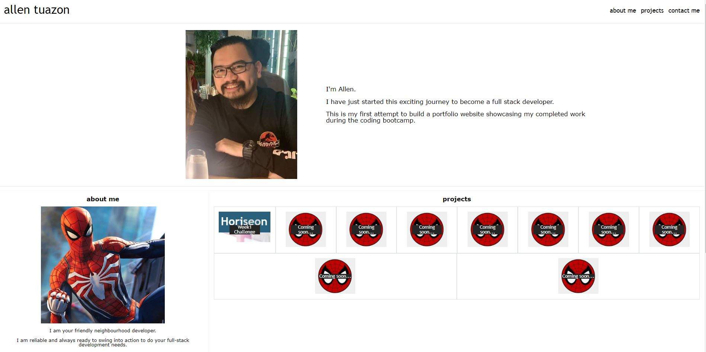

# wk2-challenge-allen

## Description

This is my submission for the Week 2 challenge.

## Table of Contents (Optional)

- [Installation](#installation)
- [Usage](#usage)
- [Credits](#credits)
- [License](#license)
- [Badges](#badges)
- [Features](#features)
- [How to Contribute](#how-to-contribute)
- [Tests](#tests)

## Installation

n/a

## Usage

Navigate to https://allentpogi.github.io/my-portfolio/ to visit the end result.

The website looks like this:

## Credits

Thanks for Jack and Sid for being awesome on week 2 as always!

## License

n/a

## Badges

n/a

## Features

n/a

## How to Contribute

n/a

## Tests

n/a
